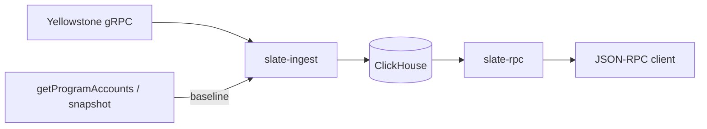

# Slate

Historical Solana account state, queryable at any past slot.

A normal Solana RPC answers "what does account X look like now." Slate answers "what did account X look like at slot N," for a slot in the past. That history isn't archived anywhere you can query today. Full snapshots are periodic and huge, and the per-slot account writes that flow past on Yellowstone gRPC get dropped once they finalize. Slate captures those writes, keeps them in ClickHouse keyed by (pubkey, slot), and serves them back through the standard Solana JSON-RPC methods with an as-of-slot argument.

> Slate is licensed under AGPL-3.0-only (see `LICENSE`).

## Status

v1. Proven end to end on devnet: live capture, as-of-slot reads, and a differential check against an independent RPC. It has not been validated at mainnet scale yet. See [Roadmap](#roadmap) for what's next.

## How it works

Slate needs a complete starting point, then everything that changes after it.

1. **Baseline.** On startup it loads the full account set for a program at a recent slot (from `getProgramAccounts`, or from a snapshot file you provide) and stamps that as the coverage floor.
2. **Stream.** It follows the Yellowstone gRPC stream from just after that slot and commits each account write when its slot finalizes.
3. **Coverage.** It records the contiguous slot ranges it has actually captured. If the stream drops and reconnects, the hole is recorded, not papered over.

Every read carries a fidelity flag. `Exact` means the answer sits inside a captured range. `Uncertain` means the query is below the floor or across a gap, so Slate still returns its best answer but tells you it can't vouch for it. It won't silently hand back stale or guessed state.



## Features

- Capture live account writes from any Yellowstone gRPC endpoint, finalized commitment.
- Bootstrap from a `getProgramAccounts` baseline or a full snapshot file.
- Standard Solana JSON-RPC, every method takes an as-of slot.
- Honest coverage: a fidelity flag on every response, recorded gaps on reconnect.
- Keyset pagination for large program scans.
- A differential harness that validates Slate against an independent reference RPC.

## RPC methods

Every method takes the pubkey(s) and an `as_of_slot`, and returns the Agave response shape plus a `context.fidelity` field.

| Method | Params | Notes |
| --- | --- | --- |
| `getAccountInfo` | `pubkey, as_of_slot` | Account state as of the slot, base64. |
| `getProgramAccounts` | `owner, as_of_slot, [limit], [cursor]` | Accounts owned by the program at the slot. Optional keyset pagination. |
| `getBalance` | `pubkey, as_of_slot` | Lamports at the slot. |
| `getMultipleAccounts` | `pubkeys[], as_of_slot` | Batched `getAccountInfo`, `null` per missing position. |

Base64 only for now. No `memcmp` / `dataSize` filters or `jsonParsed` encoding yet (see [Roadmap](#roadmap)).

## Quick start

You need Docker (for ClickHouse), Rust, a Yellowstone gRPC endpoint, and a JSON-RPC endpoint for the baseline.

```sh
# 1. Start ClickHouse
docker compose up -d

# 2. Create the tables
for f in slate-common/ddl/*.sql; do
  docker exec -i slate-clickhouse clickhouse-client --user slate --password slate --multiquery < "$f"
done

# 3. Configure
cp slate.example.toml slate.toml
# edit slate.toml: set [ingest] grpc-endpoint, program, x-token, and baseline-rpc

# 4. Capture (baseline, then live stream)
cargo run -p slate-ingest --bin live

# 5. Serve (in another terminal)
cargo run -p slate-rpc
```

Query an account as of a past slot:

```sh
curl -s localhost:8899 -X POST -H 'content-type: application/json' \
  -d '{"jsonrpc":"2.0","id":1,"method":"getAccountInfo","params":["<pubkey>", 479302991]}'
```

The response's `context.fidelity` tells you whether Slate can vouch for that slot.

## Configuration

Config lives in `slate.toml` (pass `--config` to point elsewhere). Copy `slate.example.toml` and fill it in. The gRPC token can sit in `[ingest].x-token` or in the `GRPC_TOKEN` env var, which overrides the file. Keep the real `slate.toml` out of git; it's already gitignored.

```toml
[clickhouse]
url = "http://localhost:8123"
database = "slate"
user = "slate"
password = "slate"

[ingest]
grpc-endpoint = "https://your-grpc-endpoint:443"
program = "<program pubkey>"
x-token = "<token>"
baseline-rpc = "https://your-rpc-endpoint"

[rpc]
bind = "127.0.0.1:8899"
```

## Validation

Slate ships a differential harness that checks its historical answers against a source it never saw. It reads a program's full account set from a reference RPC at that RPC's current finalized slot, waits until Slate has streamed past that slot, then diffs Slate's as-of answer against it. A match means Slate's reconstruction of a now-past slot agrees with an independent RPC, account for account.

```sh
# use an RPC that is NOT the one seeding Slate's baseline
REFERENCE_RPC=https://your-other-rpc cargo run -p slate-ingest --bin validate -- <program>
```

## Repository layout

| Crate | Purpose |
| --- | --- |
| `slate-ingest` | Live capture, baseline bootstrap, and the validation harness. |
| `slate-store` | ClickHouse access: as-of reads, coverage, fidelity. |
| `slate-rpc` | JSON-RPC server. |
| `slate-common` | Config. |

DDL for the ClickHouse tables is in `slate-common/ddl/`.

## Development

The test suite runs against a separate `slate_test` database so it never touches serving data. Create it once, with ClickHouse running:

```sh
docker exec -i slate-clickhouse clickhouse-client --user slate --password slate \
  --query "CREATE DATABASE IF NOT EXISTS slate_test"

for f in slate-common/ddl/*.sql; do
  sed 's/slate\./slate_test./g' "$f" \
    | docker exec -i slate-clickhouse clickhouse-client --user slate --password slate --multiquery
done
```

Then run the tests serially, since they share that database:

```sh
cargo test --workspace -- --test-threads=1
```

## Roadmap

- **Fill the past.** Reconstruct pre-baseline and deep-gap writes from an earlier snapshot, or by replaying archived transactions through the SVM.
- **Gap repair.** Heal recorded coverage holes from incremental snapshots while they're still in retention.
- **Durable source.** Ingest from Fumarole with cursor replay, so most gaps heal on their own.
- **asOfTime.** Query by timestamp, not just slot.
- **More surface.** `getTokenAccountsByOwner`, `memcmp` / `dataSize` filters, base58 and jsonParsed encodings, and a `getCoverage` endpoint that exposes the captured ranges directly.
- **Scale.** Cheap deep history via S3 tiering, and multi-node.

## License

AGPL-3.0-only. See [LICENSE](LICENSE).
