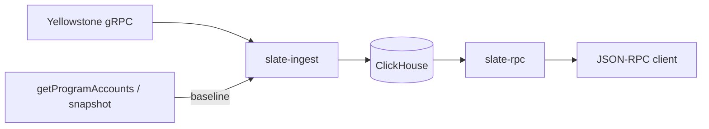

# Slate

[](https://github.com/Mctursh/slate/actions/workflows/ci.yml)

Historical Solana account state, queryable at any past slot.

A normal Solana RPC answers "what does account X look like now." Slate answers "what did account X look like at slot N," for a slot in the past. That history isn't archived anywhere you can query today. Full snapshots are periodic and huge, and the per-slot account writes that flow past on Yellowstone gRPC get dropped once they finalize. Slate captures those writes, keeps them in ClickHouse keyed by (pubkey, slot), and serves them back through the standard Solana JSON-RPC methods with an as-of-slot argument.

Slate is open source and self-hostable. You run it, point it at the program you want to capture, and the data and the source are yours.

> Slate is licensed under AGPL-3.0-only (see `LICENSE`).

## Status

v0.2. Live ingest is v1, proven on devnet, not yet mainnet-scale.

Backfill has replayed a full snapshot-to-snapshot mainnet window, 50,079 slots, verified two independent ways: every slot's bank hash checked against the consensus hash carried in that block's own vote transactions, and the end state diffed byte-for-byte against the official snapshot at the end of the range, 8,412,739 accounts with zero mismatches.

That run is epoch 808. Other epochs need the feature gating in [Roadmap](#roadmap) first, since builtin registration and precompiles currently assume the feature set at that floor. Fidelity has a tail still being closed, so the replay records coverage up to the last verified slot and never guesses.

## How it works

Slate needs a complete starting point, then everything that changes after it.

1. **Baseline.** On startup it loads the full account set for a program at a recent slot (from `getProgramAccounts`, or from a snapshot file you provide) and stamps that as the coverage floor.
2. **Stream.** It follows the Yellowstone gRPC stream from just after that slot and commits each account write when its slot finalizes.
3. **Coverage.** It records the contiguous slot ranges it has actually captured. If the stream drops and reconnects, the hole is recorded, not papered over.

Every read carries a fidelity flag. `Exact` means the answer sits inside a captured range. `Uncertain` means the query is below the floor or across a gap, so Slate still returns its best answer but tells you it can't vouch for it. It won't silently hand back stale or guessed state.

That's the live path. Backfill is the other way to fill history: instead of streaming forward, it replays a past slot range through the SVM (seeded from a snapshot, pulling blocks from an archive) and writes the same per-slot history. Use it for slots before you started, or a program you weren't watching. See [Backfill](#backfill).



## Features

- Capture live account writes from any Yellowstone gRPC endpoint, finalized commitment.
- Bootstrap from a `getProgramAccounts` baseline or a full snapshot file.
- Backfill past slots by replaying them through the SVM, seeded from a snapshot and self-verified against on-chain consensus.
- Standard Solana JSON-RPC, every method takes an as-of slot.
- Honest coverage: a fidelity flag on every response, recorded gaps on reconnect.
- Keyset pagination for large program scans.
- A differential harness that validates Slate against an independent reference RPC.

## RPC methods

The account methods take the pubkey(s) plus a config object. `asOfSlot` is optional; omit it to get the latest captured slot. Responses use the Agave `{ context, value }` shape with an added `context.fidelity`.

| Method | Params | Returns |
| --- | --- | --- |
| `getAccountInfo` | `pubkey, { asOfSlot? }` | `{ context: { slot, fidelity }, value }`. The account as base64, or `null`. |
| `getProgramAccounts` | `programId, { asOfSlot?, limit?, cursor? }` | `{ context: { slot, fidelity, nextCursor? }, value: [{ pubkey, account }] }`. Pass `limit` for keyset pagination and thread `nextCursor` until it's `null`. `cursor` is only applied with `limit`. |
| `getBalance` | `pubkey, { asOfSlot? }` | `{ context: { slot, fidelity }, value: lamports }`. |
| `getMultipleAccounts` | `pubkeys[], { asOfSlot? }` | `{ context: { slot, fidelities }, value: [...] }`. Accounts in order, `null` per missing, one fidelity per position. |
| `getCoverage` | none | `{ segments: [{ firstSlot, lastSlot }] }`. Captured slot ranges, ascending; gaps are the space between segments. |
| `getFirstAvailableSlot` | none | The earliest captured slot (number), or error `-32000` when nothing is captured yet. |

**Fidelity.** Every account read carries `context.fidelity`. `exact` means the answer sits inside a captured range; `uncertain` means it's below the floor or across a gap, so Slate still returns its best answer but flags that it can't vouch for it. New values may be added later, so treat anything you don't recognize as `uncertain`.

**Compatibility.** For `getAccountInfo`, `getBalance`, and `getMultipleAccounts` the request and response shapes match Solana, so `asOfSlot` and `fidelity` are the only additions. `getProgramAccounts` always wraps its result in the `{ context, value }` envelope (Solana returns a bare array unless you pass `withContext: true`) so the context can carry `fidelity` and `nextCursor`. Standard Solana config fields (`commitment`, `encoding`, `dataSlice`, `minContextSlot`, and `getProgramAccounts` `filters`) are accepted for compatibility but not applied yet; any other field is rejected as invalid params. lamports are JSON numbers like Solana, with the same >2^53 precision caveat. Base64 only for now; no `memcmp` / `dataSize` filters or `jsonParsed` encoding yet (see [Roadmap](#roadmap)).

**Errors.** Standard JSON-RPC 2.0 codes: `-32700` / `-32600` / `-32601` (transport), `-32602` (invalid params, e.g. a malformed pubkey), `-32603` (internal), plus `-32000` (getFirstAvailableSlot on an empty store).

## Quick start

You need Docker (for ClickHouse), Rust, a Yellowstone gRPC endpoint, and a JSON-RPC endpoint for the baseline.

```sh
# 1. Start ClickHouse
docker compose up -d

# 2. Create the tables
for f in slate-common/ddl/*.sql; do
  docker exec -i slate-clickhouse clickhouse-client --user slate --password slate --multiquery < "$f"
done

# 3. Configure
cp slate.example.toml slate.toml
# edit slate.toml: set [ingest] grpc-endpoint, program, x-token, and baseline-rpc

# 4. Capture (baseline, then live stream)
cargo run -p slate-ingest --bin live

# 5. Serve (in another terminal)
cargo run -p slate-rpc
```

Query an account as of a past slot:

```sh
curl -s localhost:8899 -X POST -H 'content-type: application/json' \
  -d '{"jsonrpc":"2.0","id":1,"method":"getAccountInfo","params":["<pubkey>", {"asOfSlot": 479302991}]}'
```

The response's `context.fidelity` tells you whether Slate can vouch for that slot.

## Backfill

Live capture only covers slots from when you started. Backfill fills the past: it replays a slot range through the SVM, seeded from a snapshot, and writes the same per-slot history. Use it for slots you missed, or a program you weren't watching.

It needs two things live capture doesn't: a **snapshot** at the start of the range to seed from, and an **archive** to pull the range's blocks from.

**Block source.** Slate reads blocks over `getBlock`, so any JSON-RPC archive works. For old slots that means [Old Faithful](https://github.com/rpcpool/yellowstone-faithful) (`faithful-cli`), which serves any historical block out of the CAR archives without downloading them.

Build `faithful-cli` from source. The prebuilt macOS release won't run on Apple Silicon (unsigned, killed on launch). It's one command:

```sh
git clone --depth 1 https://github.com/rpcpool/yellowstone-faithful
cd yellowstone-faithful && make   # needs Go; produces ./bin/faithful-cli
```

`getBlock` needs only two indexes per epoch (~11 GB), not the 837 GB CAR. The CAR is range-served over HTTP. Download the indexes and point a config at them:

```sh
EPOCH=808
CID=$(curl -s https://files.old-faithful.net/$EPOCH/epoch-$EPOCH.cid)
for t in slot-to-cid cid-to-offset-and-size; do
  curl -sL -O "https://files.old-faithful.net/$EPOCH/epoch-$EPOCH-$CID-mainnet-$t.index"
done
faithful-cli rpc --listen :8888 epoch-$EPOCH.yml   # config points at the two local indexes + the remote CAR
```

**Snapshot.** Seed from a full snapshot at the first slot of your range (mainnet snapshots live in the warehouse buckets, e.g. `gs://mainnet-beta-ledger-us-ny5/`, requester-pays). Point `--verify-boundary` at a second snapshot at the end to check the result byte-for-byte.

Backfill writes to the same ClickHouse as live capture. Have it running with the tables created ([Quick start](#quick-start) steps 1 and 2) and `[clickhouse]` set in `slate.toml`.

**Run it.**

```sh
cargo run -p slate-backfill --release -- \
  snapshot-<from>.tar.zst \
  --from <start_slot> --to <end_slot> \
  --program <pubkey> \
  --rpc http://localhost:8888 \
  --store disk --store-path accounts.redb --cache-size 34359738368 \
  --block-cache blocks.redb \
  --fetch-concurrency 16 \
  --verify-boundary snapshot-<to>.tar.zst
```

`--store disk` keeps a range too big for RAM on disk (pure Rust, no extra deps). Old Faithful flakes under load, so the fetch retries hard; `--fetch-concurrency 16` is a safe default. Drop `--verify-boundary` if you don't have the end snapshot.

**Long runs.** A run checkpoints its accounts and bank-hash roll state together every `--chunk-slots` (default 2000). If it stops, for any reason, `--resume` continues from the last checkpoint instead of re-seeding from the snapshot:

```sh
cargo run -p slate-backfill --release -- --resume \
  --from <start_slot> --to <end_slot> \
  --program <pubkey> \
  --rpc http://localhost:8888 \
  --store disk --store-path accounts.redb \
  --block-cache blocks.redb
```

`--resume` needs the same `--store-path`, and takes no snapshot argument. `--block-cache` keeps every fetched block, so a resume or re-run doesn't pull them again; point successive runs of the same range at one file.

**What you get.** As it replays, Slate rolls each slot's bank hash forward and checks it against the consensus hash carried in that block's own vote transactions, so every slot is verified against what the network agreed on, no external oracle needed. It stops at the first slot it can't reproduce and records coverage up to the last good one. The same account history lands in ClickHouse, served through the same as-of-slot RPC.

## Configuration

Config lives in `slate.toml` (pass `--config` to point elsewhere). Copy `slate.example.toml` and fill it in. The gRPC token can sit in `[ingest].x-token` or in the `GRPC_TOKEN` env var, which overrides the file. Keep the real `slate.toml` out of git; it's already gitignored.

```toml
[clickhouse]
url = "http://localhost:8123"
database = "slate"
user = "slate"
password = "slate"

[ingest]
grpc-endpoint = "https://your-grpc-endpoint:443"
program = "<program pubkey>"
x-token = "<token>"
baseline-rpc = "https://your-rpc-endpoint"

[rpc]
bind = "127.0.0.1:8899"
```

## Validation

Backfill self-verifies two ways, neither needing a reference RPC. Per slot, it checks its computed bank hash against the consensus hash carried in that block's own vote transactions (see [Backfill](#backfill)), and halts at the first slot it can't reproduce. At the end of a range, `--verify-boundary` diffs the reconstructed state against the official snapshot at `--to`, account by account, comparing lamports, owner, executable flag and data, and exits non-zero on any mismatch. The first proves each step against what the network agreed on; the second proves the destination against an artifact Slate didn't produce.

The live path is checked separately, by a differential harness: it reads a program's accounts from a reference RPC at that RPC's current slot, waits for Slate to stream past it, then diffs Slate's as-of answer. A match means Slate's reconstruction of a now-past slot agrees with an RPC it never saw, account for account.

```sh
# use an RPC that is NOT the one seeding Slate's baseline
REFERENCE_RPC=https://your-other-rpc cargo run -p slate-ingest --bin validate -- <program>
```

## Repository layout

| Crate | Purpose |
| --- | --- |
| `slate-ingest` | Live capture, baseline bootstrap, and the validation harness. |
| `slate-replay` | SVM replay engine: seed from a snapshot, replay blocks, self-verify each slot's bank hash. |
| `slate-backfill` | Backfill CLI: drives the replay over a slot range and persists the history. |
| `slate-store` | ClickHouse access: as-of reads, coverage, fidelity. |
| `slate-rpc` | JSON-RPC server. |
| `slate-common` | Config. |

DDL for the ClickHouse tables is in `slate-common/ddl/`.

## Development

The test suite runs against a separate `slate_test` database so it never touches serving data. Create it once, with ClickHouse running:

```sh
docker exec -i slate-clickhouse clickhouse-client --user slate --password slate \
  --query "CREATE DATABASE IF NOT EXISTS slate_test"

for f in slate-common/ddl/*.sql; do
  sed 's/slate\./slate_test./g' "$f" \
    | docker exec -i slate-clickhouse clickhouse-client --user slate --password slate --multiquery
done
```

Then run the tests serially, since they share that database:

```sh
cargo test --workspace -- --test-threads=1
```

## Roadmap

- **Feature gating for other epochs.** Builtin registration and precompile verification currently assume the feature set at the epoch-808 floor, so an earlier range would use programs that weren't active yet. Gate them on the per-slot feature set the replay already builds.
- **Backfill fidelity.** Close the remaining tail of historical transactions the replay can't yet reproduce, a class at a time.
- **Multi-epoch backfill.** Span successive snapshot windows to reconstruct a whole epoch and beyond.
- **Gap repair.** Heal recorded coverage holes from incremental snapshots while they're still in retention.
- **Durable source.** Ingest from a replayable stream (Triton's Fumarole, Helius's LaserStream, and the like), so a reconnect rewinds and most gaps heal on their own.
- **asOfTime.** Query by timestamp, not just slot.
- **More surface.** `getTokenAccountsByOwner`, `memcmp` / `dataSize` filters, base58 and jsonParsed encodings.
- **Scale.** Cheap deep history via S3 tiering, and multi-node.

## License

AGPL-3.0-only. See [LICENSE](LICENSE).
