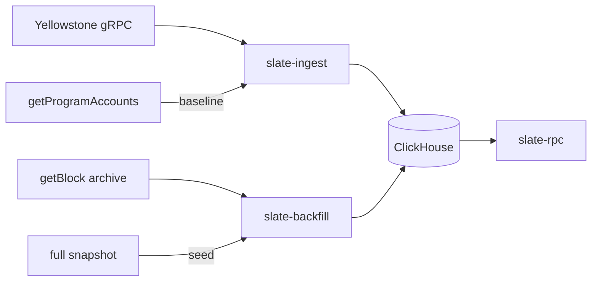

# Slate

[](https://github.com/Mctursh/slate/actions/workflows/ci.yml)

Historical Solana account state, served over JSON-RPC at any past slot.

Slate stores every account write for a program in ClickHouse, keyed by `(pubkey, slot)`, and answers `getAccountInfo`, `getProgramAccounts`, `getBalance` and `getMultipleAccounts` with an `asOfSlot` argument. History comes from two places: live capture off Yellowstone gRPC, and backfill, which replays past blocks through the SVM and checks every slot against consensus.

> [!NOTE]
> AGPL-3.0-only. See `LICENSE`.

## Status

Backfill replays mainnet era 1 (epochs 807 to 978) on agave 3.1.14. Live capture is tested on devnet, not yet at mainnet scale.

| Check | Result |
| --- | --- |
| Longest contiguous range | 440,342 slots from epoch 807 to 809, crossing both boundaries, every bank hash matching a consensus vote |
| Epoch boundaries reproduced | 808, 809, 823, 825, 943, 949, 971 |
| Account-rewriting boundaries | all four in era 1: 823 Stake to Core BPF, 943 Rent sysvar, 949 vote state v4, 971 p-token |
| Not yet verified | 20 of the 27 feature activations in era 1 have no replayed window through them (4 are networking-only) |

Per-window numbers are in [workers/README.md](workers/README.md).

## How it works


```mermaid
flowchart LR
  GRPC[Yellowstone gRPC] --> Ingest[slate-ingest]
  RPC[getProgramAccounts] -->|baseline| Ingest
  Blocks[getBlock archive] --> Backfill[slate-backfill]
  Snap[full snapshot] -->|seed| Backfill
  Ingest --> CH[(ClickHouse)]
  Backfill --> CH
  CH --> Serve[slate-rpc]
```

- **Live.** Loads a program's accounts with `getProgramAccounts`, then streams writes from Yellowstone gRPC. Writes are buffered per slot and committed when the slot finalizes. A reconnect starts a new coverage segment, so the gap stays visible.
- **Backfill.** Seeds from a full snapshot, replays blocks through the agave SVM, and halts at the first slot it can't reproduce. Coverage is recorded up to the last good slot.
- **Fidelity.** Every read says `exact` (inside a covered segment) or `uncertain` (below the floor or across a gap).
- Coverage isn't tracked per program, so keep one program per database.

## RPC methods

| Method | Params | Returns |
| --- | --- | --- |
| `getAccountInfo` | `pubkey, { asOfSlot? }` | `{ context: { slot, fidelity }, value }` |
| `getBalance` | `pubkey, { asOfSlot? }` | `{ context: { slot, fidelity }, value: lamports }` |
| `getMultipleAccounts` | `pubkeys[], { asOfSlot? }` | `{ context: { slot, fidelities }, value: [...] }`, one fidelity per position |
| `getProgramAccounts` | `programId, { asOfSlot?, limit?, cursor? }` | `{ context: { slot, fidelity, nextCursor? }, value }`. Page with `limit`, follow `nextCursor` until `null` |
| `getCoverage` | none | `{ segments: [{ firstSlot, lastSlot }] }` |
| `getFirstAvailableSlot` | none | earliest covered slot |

- Omit `asOfSlot` to read at the latest covered slot. With nothing covered yet, reads return `-32000`.
- Data is base64 only. `commitment`, `encoding`, `dataSlice`, `minContextSlot`, `filters` and `withContext` are accepted so Solana clients work, but **ignored**: a `getProgramAccounts` call with `filters` returns every account. Unknown fields are rejected with `-32602`.
- `getProgramAccounts` always returns the `{ context, value }` envelope.
- Treat an unrecognized `fidelity` value as `uncertain`.

## Quick start

Needs Docker, Rust, a Yellowstone gRPC endpoint and a JSON-RPC endpoint for the baseline.

```sh
docker compose up -d        # ClickHouse, dev credentials slate/slate

for f in slate-common/ddl/*.sql; do
  docker exec -i slate-clickhouse clickhouse-client --user slate --password slate --multiquery < "$f"
done

cp slate.example.toml slate.toml   # set [ingest] grpc-endpoint, program, x-token, baseline-rpc

cargo run -p slate-ingest --bin live   # baseline, then live stream
cargo run -p slate-rpc                 # serves on 127.0.0.1:8899
```

```sh
curl -s localhost:8899 -X POST -H 'content-type: application/json' \
  -d '{"jsonrpc":"2.0","id":1,"method":"getAccountInfo","params":["<pubkey>",{"asOfSlot":479302991}]}'
```

The compose file is for local use only: default password, ports published on the host.

## Configuration

`slate.toml`, or `--config <path>`. Every key is in [slate.example.toml](slate.example.toml). `GRPC_TOKEN` overrides `[ingest].x-token`. `slate.toml` is gitignored.

## Backfill

Needs a full snapshot at the start of the range and a `getBlock` source for the blocks. Writes to the same ClickHouse as live capture.

**Snapshot.** Mainnet full snapshots for every epoch are in the Solana Foundation warehouse buckets (for example `gs://mainnet-beta-ledger-us-ny5/`, requester-pays).

**Blocks.** Any `getBlock` RPC works. For old slots, run [Old Faithful](https://github.com/rpcpool/yellowstone-faithful) locally: it needs only the epoch's `slot-to-cid` and `cid-to-offset-and-size` indexes on disk and reads the CAR over HTTP. Build `faithful-cli` from source (`make`, needs Go); the prebuilt macOS binary is killed on launch on Apple Silicon.

```sh
EPOCH=808
CID=$(curl -s https://files.old-faithful.net/$EPOCH/epoch-$EPOCH.cid)
for t in slot-to-cid cid-to-offset-and-size; do
  curl -sL -O "https://files.old-faithful.net/$EPOCH/epoch-$EPOCH-$CID-mainnet-$t.index"
done
faithful-cli rpc --listen :8888 epoch-$EPOCH.yml   # yml points at the two indexes and the remote CAR
```

**Run** from the era's worker ([workers/README.md](workers/README.md) says which era covers which epochs):

```sh
cd workers/agave-3.1.14
cargo run -p slate-backfill --release -- \
  snapshot-<from>.tar.zst \
  --from <snapshot_slot> --to <end_slot> \
  --program <pubkey> \
  --rpc http://localhost:8888 \
  --store disk --store-path accounts.redb --cache-size 34359738368 \
  --block-cache blocks.redb \
  --fetch-concurrency 16 \
  --verify-boundary snapshot-<to>.tar.zst
```

| Flag | What it does |
| --- | --- |
| `--store disk` | keep accounts in a redb file instead of RAM; needed for mainnet-size ranges |
| `--block-cache` | keep fetched blocks so a rerun or resume doesn't fetch them again |
| `--verify-boundary` | diff the end state byte-for-byte against the real snapshot at `--to`; exits non-zero on any mismatch |
| `--resume` | continue from the last checkpoint; pass the same snapshot, `--store-path` and `--block-cache` |
| `--chunk-slots` | slots per checkpoint, default 2000 |
| `--dry-run` | fetch and parse the range without a snapshot, as a preflight |

Each long phase prints one progress line with a count, rate and ETA. It redraws in place on a terminal and prints a fresh line every 30s when piped to a log.

A run stops at the first slot it can't reproduce and prints `halted at slot ...`. That still exits 0, so check the output, not the exit code.

## Tests

Root workspace tests use a separate `slate_test` database. Create it once, with ClickHouse running:

```sh
docker exec -i slate-clickhouse clickhouse-client --user slate --password slate \
  --query "CREATE DATABASE IF NOT EXISTS slate_test"
for f in slate-common/ddl/*.sql; do
  sed 's/slate\./slate_test./g' "$f" \
    | docker exec -i slate-clickhouse clickhouse-client --user slate --password slate --multiquery
done

cargo test --workspace -- --test-threads=1
```

Each era worker is its own workspace and needs no database:

```sh
cd workers/agave-3.1.14
cargo test --workspace   # unit tests + slot fixtures, offline
cargo test --release -p slate-replay --features boundary-fixtures --test boundary_fixtures
```

Slot fixtures are recorded mainnet slots in `fixtures/slots/`, replayed to their consensus bank hash. Boundary fixtures are six epoch-boundary blocks, about 900 MB from the `fixtures-v1` release, cached in `target/boundary-fixtures/` after the first run. Each directory's `expected.txt` says what every fixture covers. CI runs both.

## Validation

Backfill checks itself three ways: every transaction's status, fee, lamports and token balances against the block's recorded meta; every slot's bank hash against consensus votes; and with `--verify-boundary`, the end state against the real snapshot.

Live capture is checked against an independent RPC that did not seed the baseline:

```sh
REFERENCE_RPC=https://your-other-rpc cargo run -p slate-ingest --bin validate -- <program>
```

## Repository layout

| Path | Purpose |
| --- | --- |
| `slate-ingest` | live capture, baseline load, differential validator |
| `slate-store` | ClickHouse reads and writes, coverage, fidelity |
| `slate-rpc` | JSON-RPC server |
| `slate-common` | config; ClickHouse DDL in `ddl/` |
| `slate-hash` | lattice hash and bank hash, byte API, shared by every era |
| `slate-format` | versioned on-disk formats: account record, checkpoint, fixture |
| `workers/agave-3.1.14` | era 1: replay engine (`slate-replay`) and CLI (`slate-backfill`), own lockfile and toolchain |

## What's coming

- **v0.3.0.** Halts that say what kind of failure they are, with exit codes to match, so a long run can go unattended.
- **v0.3.1.** Fetch the next chunk while replaying the current one.
- **Era 2.** A worker on agave 4.2.1 for epoch 979 to the tip.
- **Era 1 coverage.** Replay windows through the 16 execution-relevant activations not yet crossed.
- **RPC surface.** `memcmp` / `dataSize` filters, `dataSlice`, base58 and jsonParsed, `getTokenAccountsByOwner`.
- **Live capture.** Snapshot bootstrap, a replayable stream (Fumarole, LaserStream) so reconnects heal, gap repair from incremental snapshots.
- **Later.** `asOfTime`, S3 tiering for deep history.

## License

AGPL-3.0-only. See [LICENSE](LICENSE).
